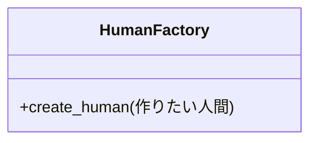

# 単純ファクトリーとFactory Methodについて

## 単純ファクトリーパターン

条件分岐のついた生成メソッドを持つクラスのこと。
渡されたオブジェクトの種類や引数によって作るインスタンスを変える。
メリットは似たような生成ロジックをまとめることができること。
デメリットは、オブジェクトの種類や引数が増えていくとそれと共にクラスが巨大化していくこと。

### クラス図



### 具体的なコード

このくらいのFacoryなら整理しやすい

```python
class Child:
    def speak(self):
        print("子供です！！！！")

class Adult:
    def speak(self):
        print("大人です！！！！")


class HumanFactory:
    def create_human(human_type):
        if human_type == "子供":
            return Child()
        if human_type == "大人":
            return Adult()
```

こうなってくるとやばい

```python
class HumanFactory:
    def create_human(human_type):
        if human_type == "赤ちゃん":
            return Baby()
        if human_type == "子供":
            return Child()
        if human_type == "中学生":
            return Junior()
        if human_type == "高校生":
            return Highschool()
        if human_type == "大人":
            return Adult()
        if human_type == "おじいさん":
            return Adult2()
        if human_type == "おばあさん":
            return Adult3()
```

## ファクトリーメソッドパターン

Gofの生成デザインパターンの一つ。
インスタンスの作り方をスーパークラスで決めて、サブクラスで具体的な作り方を決めるやり方。

## まとめ

調べたところ、単純ファクトリーは「悪」ということではなく、むしろこちらがファクトリーメソッドパターンより使われていそう。

1. ファクトリーパターンで作ったクラスが大きくなってしまった！！
1. 大きすぎて読みづらいから、クラス内のメソッドをサブクラスに移して読みやすいようにしよう。
1. あれ？2を繰り返している間にいつの間にかFactoryMethodになっているね！いい感じだね！

という流れでのリファクタリングの最終ゴールがFactoryMethodみたい。
リファクタリングの指標の一つと覚えておけばよさそう。

## 参考

デザインパターン「Factory Method」
<https://qiita.com/shoheiyokoyama/items/d752834a6a2e208b90ca>

デザインパターン入門Factory Methodパターンについて
<https://zenn.dev/komorimisaki422/articles/21e40f13f514ae#5.-factory-method%E3%83%91%E3%82%BF%E3%83%BC%E3%83%B3%E3%81%AE%E3%81%BE%E3%81%A8%E3%82%81>>

ファクトリーの比較
<https://refactoring.guru/ja/design-patterns/factory-comparison>
