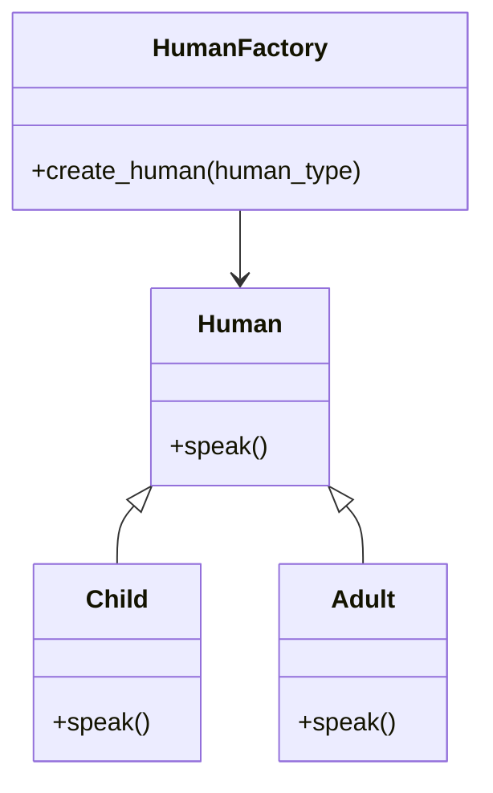
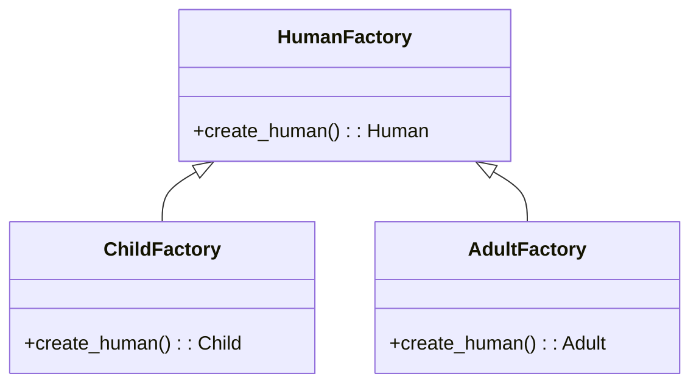

# 単純ファクトリーとFactory Methodについて

## 単純ファクトリーパターン

条件分岐のついた生成メソッドを持つクラスのこと。

渡されたオブジェクトの種類や引数によって作るインスタンスを変える。

メリットはわかりやすいことと、似たようなオブジェクトの生成ロジックをまとめることができること。

デメリットは、オブジェクトの種類や引数が増えていくと、共にクラスが巨大化していくこと。

引数で切り替えるオブジェクトを管理する必要があること。

（手を入れる際はメソッドの中身と引数を照らし合わせてどんなオブジェクトが作られるか把握する必要がある）

これはGoFのデザインパターンには含まれていない。

### 単純ファクトリーパターンのクラス図



### 単純ファクトリーパターンの具体的なコード

人間オブジェクトを作るメソッドを持ったクラス

大人 or 子供 くらいであれば単純ファクトリーで良さそう

```python
from abc import ABC, abstractmethod

class Human(ABC):
    @abstractmethod
    def speak(self):
        pass

class Child(Human):
    def speak(self):
        print("子供です！！！！")

class Adult(Human):
    def speak(self):
        print("大人です！！！！")


class HumanFactory:
    def create_human(human_type):
        if human_type == "子供":
            return Child()
        if human_type == "大人":
            return Adult()

human = HumanFactory.create_human("子供")
human.speak() # 子供です！！！！
```

新しく人間オブジェクトを増やそうかな、create_humanメソッドに手を入れることになるが

オブジェクトの種類が増えると、以下のように複雑になりがち

```python
class HumanFactory:
    def create_human(human_type, sex, age):
        if human_type == "赤ちゃん":
            return Baby()
        if human_type == "子供":
            return Child()
        if human_type == "中学生":
            return Junior()
        if human_type == "高校生":
            return Highschool()
        if human_type == "大人":
            if sex == "男":
                return Adult()
            if sex == "女":
                return Adult2()
        if age == 60 and sex == "男":
            return ojiisan()
        if age == 60 and sex == "女":
            return obaasan()

human = HumanFactory.create_human("年配", "男", 60) # 何が返ってくるんだろう？ってなりがち
human.speak() # おじいさんです！！！！
```

時間が経つにつれて、オブジェクトの種類が増えていくと、管理が大変になってくる。

その時になって初めて、GoFのファクトリーメソッドパターンやAbstractFactoryパターンを使うと良さそう。

もちろん、作るオブジェクトが最初から増える見込みであればファクトリーメソッドやAbstractFactoryパターンを使ってもいいと思う。

(調べたところ現実ではこの単純ファクトリーでの実装が多いとのこと、やっぱりわかりやすいから？)

## ファクトリーメソッドパターン

Gofの生成デザインパターンの一つ。

抽象クラスで生成するオブジェクトのインターフェースを設定し、それを元にサブクラスで具体的なオブジェクトを生成する。

### ファクトリーメソッドパターンのクラス図



## ファクトリーメソッドパターンの具体的なコード

```python

```

## まとめ

調べたところ、単純ファクトリーは「悪」ということではなく、むしろこちらがファクトリーメソッドパターンより使われていそう。

1. ファクトリーパターンで作ったクラスが大きくなってしまった！！
1. 大きすぎて読みづらいから、クラス内のメソッドをサブクラスに移して読みやすいようにしよう。
1. あれ？2を繰り返している間にいつの間にかFactoryMethodになっているね！いい感じだね！

という流れでのリファクタリングの最終ゴールがFactoryMethodみたい。

リファクタリングの指標の一つと覚えておけばよさそう。

## 参考

デザインパターン「Factory Method」
<https://qiita.com/shoheiyokoyama/items/d752834a6a2e208b90ca>

デザインパターン入門Factory Methodパターンについて
<https://zenn.dev/komorimisaki422/articles/21e40f13f514ae#5.-factory-method%E3%83%91%E3%82%BF%E3%83%BC%E3%83%B3%E3%81%AE%E3%81%BE%E3%81%A8%E3%82%81>>

ファクトリーの比較
<https://refactoring.guru/ja/design-patterns/factory-comparison>
